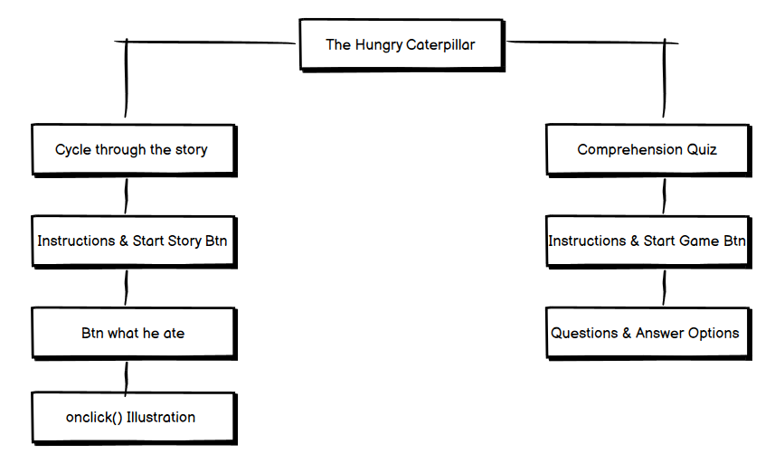
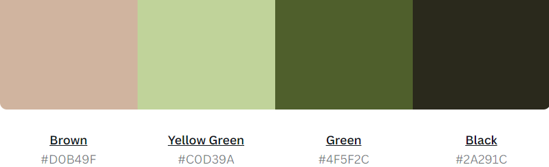
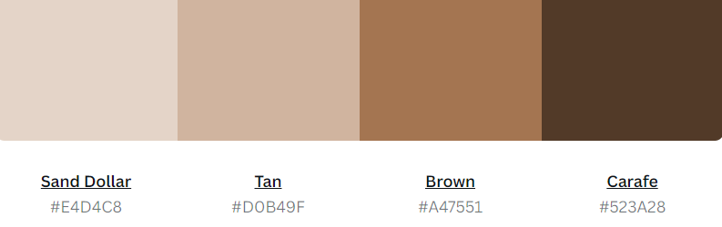

# The Hungry Caterpillar
# Milestone Project 2:  *Deminstration of JavaScript understand, through text based kids stroybook.* 

DISCLAIMER: This is a project for Code Institute, the story of 'The Hungry Caterpillar' is being used to demonstrate understanding of Javascript, and not for finacial gain. 

# Live Project 

[View live project here](https://jjbr13.github.io/Justin-Brown-milestone-project-two/)

# Repository 

[Locate project repository here](https://github.com/JJBR13/Justin-Brown-milestone-project-two)

# Contents 

- [Ideology](#ideology)
- [User Experience](#user-eperience)
    + [User Stories](#user-stroies)
- [Design](#design)
    + [Wireframes](#wireframes)
    + [Colour Palette](#colour-palette)
    + [Typography](#typography)
    + [Images](#images)
- [Current Features](#current-features)
    + [Responsive On All Devices](#responsive-on-all-devices)
- [Future Releases](#future-releases)
- [Languages Used](#languages-used)
- [Testing](#testing)
- [Deployment](#depolyment)
    + [Project Creation](#project-creation)
    + [GitHub Pages](#github-pages)
    + [Local Deployment](#local-deployment)
- [References, Credit, Framework & Programs](#references-credit-framework--programs)
    + [References](#references)
    + [Credit](#credit)
    + [Framework](#framework)
    + [Programs](#programs)
    
## Ideology

The idea behind this game is to allow children to follow a story along through interection and illustrations. Both to learn, better their reading and comprehension skills. 

## User Experience 

### User Stories 

#### The Child

*The children using this story game*

* Being the child, I want easy flow to the game. 
* Being the child, I want to be able to use it on my Ipad/ tablet phone. 

#### The Parent 

* Being the parent, I want to have educational value. 
* Being the parent, I want easy follow and understanding of how it works. 
* Being the parent, I want to be able to leave my kid in control of the game. 

#### Asylum Seeker 

* Being a Asylum seeker, I want to be able to read the story at my own pace. 
* Being a Asylum seeker, I would like visual aids to visulise the text. 

## Design 

### Wireframes 

[Click here for Wireframe PDF](wireframes.pdf)

### Colour Pallete 

- The colour scheme was planned to go hand in hand with the context of the book and ilustrations. Hence selecting natural and nuteral pallettes of the browns and greens were chosen to create desired result. 

### Typography 

[*Sourced via google fonts.*](https://fonts.google.com/)

- All content text used 'Architects Daughter', this was decided by an arcticle written by Claudia Wild. She dicussed the top 10 fonts for children. Discucussing readability and ability for the font. 

### Images 

- The use of images were highly important to create the engagement factor for the user. Through out the stroy the user would have an illustration pop up that was related to the reading of the current text. 

## Current Features

### Favicon 

- A site wide favicon of a the hungry caterpillar, this creates an image to be present within the tabs allowing the user to easily identify the site when multiple are open. Aids user stories: 

> i. Being the parent, I want easy follow and understanding of how it works.

### Start Button 

- A button appears as on page load that will initiate the start of the story, this will allow the user to start the story after they had read and understood the instructions, following user stories: 

> i. Being the child, I want easy flow to the game.
> ii. Being the parent, I want easy follow and understanding of how it works.

### Instructions

- Instructions will appear in two areas. Firstly, on page load directing the user to what is happening before pressing start story. Secondly, before they start the comprehention quiz, this allows the user to understand how the quiz will work. Enhancing user stories:  

> i. Being the parent, I want easy follow and understanding of how it works.
> ii. Being the child, I want easy flow to the game.

### Error Page 

- This is .html file that has been created and customised to enable the user to navigate back to the index.html page, to restart the story, if an error happens when navigating the site. Allowing user below user stories to be met: 

> i. Being the parent, I want easy follow and understanding of how it works.
> ii. Being the child, I want easy flow to the game.

### Story Interateraction 

- To add interactive elements is highly import to enage the user through out the progresstion of the story. This was done by adding images to pop up that were associated with the story. Meeting requirement of user story: 

> i. Being a Asylum seeker, I would like visual aids to visulise the text. 

### Comprehension Quiz

- This allows the user to test there understading of the story they have read, consolidating thier understating. Allowing user story: 

> i. Being the parent, I want to have educational value. 

### Type Naration Text 

> i. Being a Asylum seeker, I want to be able to read the story at my own pace. 

### Responsive On All Devices 

> i. Being the child, I want to be able to use it on my Ipad/ tablet phone. 

## Feature Releases 

### 1) Creation of animations 

- Depending what options are are selected maybe a little animation could accompany the selection, increasing interaction for the user. 

### 2) Addition of more books/ website 

- Add more children stories in this format. Creating a website to house all the story games to allow multiple options. 

### 3) Read the stroy out load

- Create a text to speach reader that reads the narrations to the user. Also maybe has a control pannel that allows the user to pause the reader and select the speed in which the narration is read at. 

## Languages Used  

- [HTML5](https://www.w3schools.com/whatis/whatis_html.asp)
- [CSS3](https://www.w3schools.com/whatis/whatis_css.asp)
- [JavaScript](https://www.w3schools.com/whatis/whatis_js.asp)

## Testing 

- Please see [TEST.md](TEST.md) for a breakdown of website testing and debugging.

## Deployment 

### Project Creation 

- This project was created through GitHub: 
 1. Locating repository, clicking on the "New" button.
 2. Selecting the relevant template:  "Code-Institute-Org/gitpod-full-template" 
 3. Adding the repository name "JJustin-Brown-milestone-project-two".
 4. Clicking the button "Create repository". 

- Adding the Chrome extension "GitPod" created an online coding platform, enabling the use of bash terminals throughout the project. The below "git commands" were used: 

1. git add . - This command for multiple files to the staging area before commiting. 
2. git commit -m "Message explaining upadate" - This command explained changes that were done to the repository. 
3. git push - This command was used to push all committed changes to the GitHub Repository. 

### Github Pages 

1. Go to [GitHub login](https://github.com/login), proceed to log in.
2. Open [GitHub repository](https://github.com/JJBR13/Justin-Brown-milestone-project-two)
3. Locate the navbar at the top of the repository (Not the tope of the web page). Click the Settings tab. 
4. Locate the NEW navigation bar on the LEFT side. Click "Pages" under the sub-heading "Code and automation". 
5. Under "Source", click the dropdown named "None" and select "Main". 
6. Click Save. The page will automatically refresh. With a notification at the top of the page, with the [link](https://jjbr13.github.io/Justin-Brown-milestone-project-two/) to your published site. 
7. You can return to the Github pages section to access the link.

### Local Deployment 

1. Navigate to the [Github](https://github.com/JJBR13/Justin-Brown-milestone-project-two).
2. Click the "Code" dropdown button. 
3. Select "Download ZIP" or " Open with GitHub Desktop"
4. Unpackage ZIP file locally with Integrated Development Environment (IDE).

## References, Credit, Framework & Programs 

### References

- [Canva.com](https://www.canva.com/colors/color-palettes/sweet-succulents/): Used to gage simplistic pallets for design. 

- [Pixabay](https://pixabay.com/illustrations/caterpillar-insect-bug-antennae-5485835/): Acessing free png images to use as favicon and engaging content for the user. 

- [Google Fonts](https://fonts.google.com/): Used to import fonts into style.css. 

- [Flaticon](https://www.flaticon.com/): Resourced used to create cartoon illustrations. 

- [Clean PNG](https://www.cleanpng.com/free/hungry-caterpillar-,2.html): Used Eric Care illustrations where possible, the PNG were located from ths site.

### Credit 

- Claudia Wild: Great insight to fonts that interect with engagement and learning for children [Find Here](https://www.e-learnconnect.com/post/the-10-best-child-friendly-fonts-for-kids).

### Framework 

- [Bootstrap](https://getbootstrap.com/docs/5.2/getting-started/contents/#bootstrap-source-code)
  - Bootstrap v5.2 was used throughout the entire site to make it responsive.

### Programs 

- [Balsamiq](https://balsamiq.com/)
   - Allowed the creation of the wireframes.

- [Adobe Suite](https://www.adobe.com/uk/)
  - Used to adjust/enhance images and create the logo for the site.