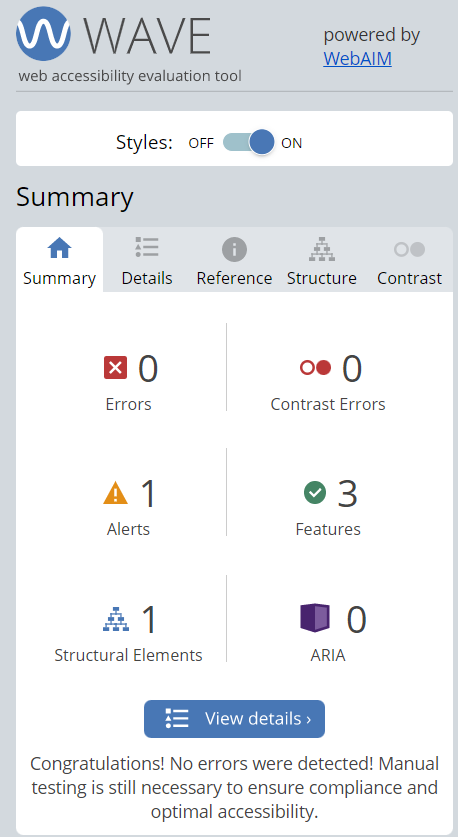
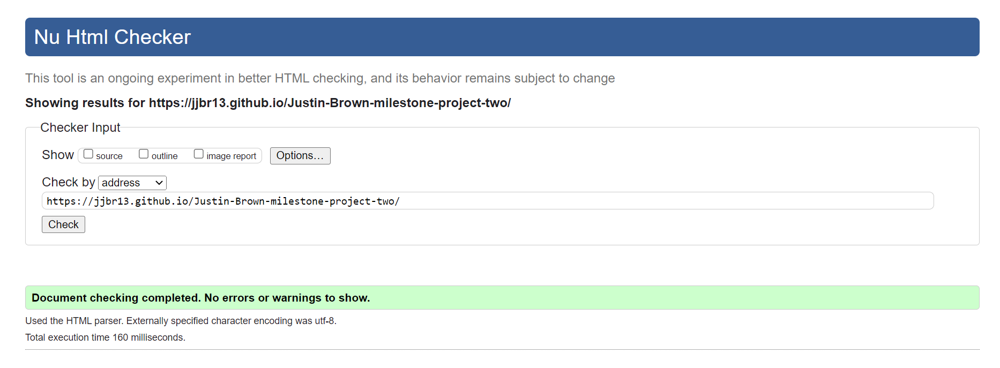
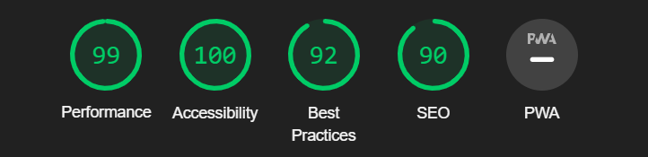
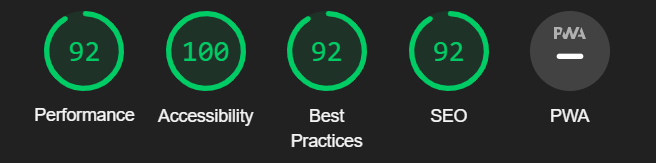

# Testing 

Tests were done site wide, all tests undertaken are show below: 

## Contents 

- [Functional Testing](#functional-testing)
- [Wave](#wave)
- [Validator Testing](#validator-testing)
  + [HTML](#html)
  + [CSS](#CSS)
- [Lighthouse](#lighthouse)
  + [Desktop Results](#desktop-results)
  + [Mobile Results](#mobile-results)
- [Colour Contrast](#colour-contrast)
- [Browser Compatibility](#browser-compatibility)
- [Responsivity](#responsivity)
- [Issues/ Bugs Found & Resolved](#issues-bugs-found--resolved)

## Functional Testing 

### 1. 

Destcription:

Ensure start button starts the story 

Steps: 

I. Click start button  
II. Desplay narration line, image and option button 

Expected: 

Start button when clicked displays start of the story, related img and option button to progress.

Outcome: 

Start button displayed narration line, img and option buttons.

### 2. 

Description: 

Story moves to next narrations when option button is clicked. 

Steps: 

I. Click option button  
II. Progress to next narration line, image, option button 

Expected: 

Progress through the story on click. 

Outcome: 

Option buttons clicked and progressed through story. 

### 3. 

Description: 

At end of story, instructions and start game button displays. 

Steps: 

i. Last option button is clicked   
ii. Displays game instructions and game start button

Expected: 

Last option button triggers game discriptions. 

Outcome: 

Last options tiggered game instruction and start game button. 

### 4. 

Description: 

Start game button is clicked displays intial questions and answer options. 

Steps: 

i. Click Start game button   
ii. Displays first question and answer button options 

Expected: 

To display questions 

Outcome: 

Displayed questions and answer after start game button is clicked. 

### 5. 

Description: 

When answer is clicked display correct and incorrect answer colours to button 

Steps: 

i. Click answer options  
ii. Display correct and incorrect background colour 

Expected: 

Onclick shows what answers are correct and incorrect 

Outcome: 

Correct and incorrect backgrounf colours displayed when answer button was clicked. 

### 6. 

Description: 

Next button to appear when answer options was clicked. 

Steps: 

i. Click answer option  
ii. Next button is displayed

Expected: 

Answer option button clicked, next button appears. 

Outcome: 

When answer option button was clicked, next button appears. 

### 7. 

Description: 

At end of questions thank you message and back to story button displays. 

Steps: 

i. When questions finish  
ii. Display thank you message and button

Expected: 

When last question answer is clicked display message and back to story button. 

Outcome: 

After last question answer option button was clicked both appeared. 

## 8. 

Description: 

Back to story button restarts stroy. 

Steps: 

i. Click back to story button   
ii. Returns to start story instruction. 

Expected: 

When button clicked to return to the start of the story. 

Outcome: 

On click button returns user to start story button and description. 

## Wave 

[WAVE link](https://wave.webaim.org/)

- This Chrome extention was used throughout the build of my webpage game to, make sure nothing was being missed along the build process. 

## Validator Testing 

### HTML 

[W3C HTML Validator link](https://validator.w3.org/)

- Intially this showed three warnings, missing of alt image tag & to remove type from script tags. All these suggestions were completed. 

### CSS 

[W3C CSS Validator link](https://jigsaw.w3.org/css-validator/#validate_by_input+with_options)

- This check returned no issues. 

## Lighthouse 

- Lighthouse was used towards the end of the build, this is accessed through chrome developer tools analysing the following:

  - Performance 
  - Acessibility 
  - Best Practise 
  - SEO

- This was check for both desktop and mobile devices 

### Desktop Results 

### Mobile Results 

## Colour Contrast

[A11y Color link](https://color.a11y.com/)

- A11y Color validator was used to check the contrasts of colour site wide. 

## Browser Compatibility 

- This site was tested on Chrome, Microsoft Edge, and Firefox on desktop.

- The website was tested in Chrome on mobile and tablet. 

- All tested devices were consistent across browsers.

## Responsivity 

Responsiveness was tested through Chrome Developer tools. The devices tested include:

- Iphone 6/7/8 plus 
- Iphone 12 Pro 
- Iphone XR 
- Ipad 
- Ipad Air 
- Ipad Mini
- Pixel 5
- Galaxy Fold 
- Galaxy S8+
- Surface Duo

The site was actively tested on my Galaxy Fold, Ipad Air & Blade 15 Razor Laptop.

## Issues/ Bugs Found & Resolved

**a) Making site responsive and section appear over the top of each other.**

- After diving into the project, it was quickly realised the basic design was not achieving desired outcome. This was when Bootstrap was introduced. Creating quick and easy resolve to issues that were created. 

**b) Phone resposivity**

- When using dev tools the whole alignment was thrown to the left, this again was resolved by correct div structures through the use of unicorn and bootstrap. 

**c) Back button restarting story**

- Syncing the back button to the restart the story from the start, caused me confustion and incorrect display with JavaScript functions. This was resolved by adding onClick function reload to the button within the index.html. 

**d) Image cycling through array, syncing with story narrations & buttons 

- This is still not perfect! But reloved through long winded else if function. 

## Unresolved 

**a) typeText() not progressing through the complete story narrations.**

**b) Removing the :hover when answers are showing whether they are correct or incorrect.**

**c) Last questions answers pausing to show results before progressing to thank you message.**

Back to [README.md](/README.md)